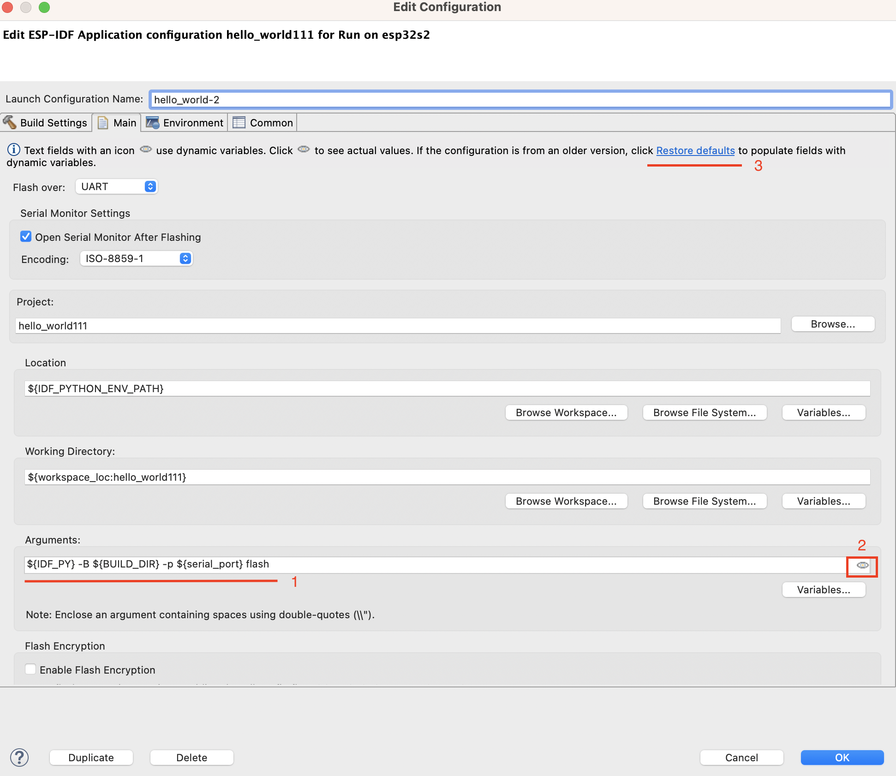
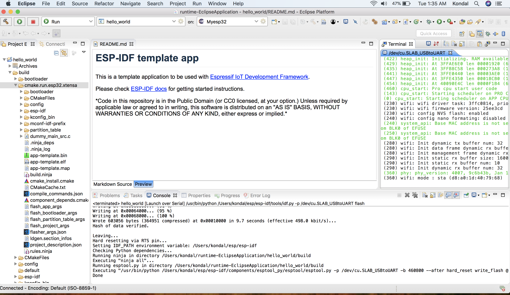
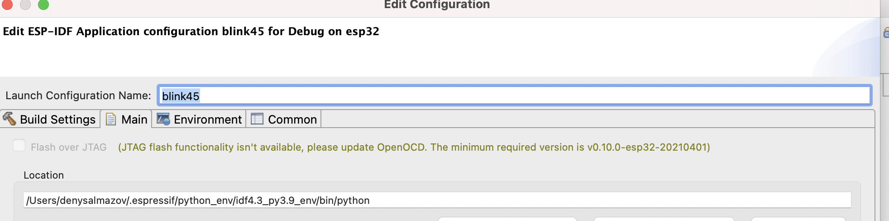

烧录项目
========

:link_to_translation:`en:[English]`

.. |run_icon| image:: ../../media/icons/run.png
   :height: 16px
   :align: middle

只需点击启动按钮 |run_icon| 即可开始烧录，该过程会自动使用默认命令 ``idf.py -p PORT flash`` 来烧录应用程序。

.. image:: https://github.com/espressif/idf-eclipse-plugin/assets/8463287/3249c01b-af23-4863-811f-c3959008f257
   :width: 767px
   :alt: 烧录

- 如需自定义烧录参数，请参照 :ref:`本指南 <customizeLaunchConfig>` 中的说明。
- 如需启用 flash 加密，请参阅 :ref:`flash 加密 <flashEncryption>`。
- 如需通过 JTAG 进行烧录，请参阅 :ref:`JTAG 烧录 <JTAGFlashing>`。

.. _customizeLaunchConfig:

自定义烧录参数
--------------

如需提供自定义的启动配置和烧录参数，请按以下步骤操作：

#. 点击 ``Launch Configuration`` 编辑按钮。
#. 切换到 ``Main`` 选项卡。
#. 指定应用需运行的 ``Location``。``idf.py`` 是一个 Python 文件，所以请配置 Python 系统路径。例如：``${system_path:python}``。
#. 指定应用的 ``Working directory``。例如：``${workspace_loc:/hello_world}``。
#.  在 ``Arguments`` 字段中（见图片中的 ``1``），默认使用 **动态变量**：

    ``${IDF_PY} -B ${BUILD_DIR} -p ${serial_port} ${flash_command}``

    该默认设置会基于项目和开发板自动适配，通常无需手动更改。

    - 点击 ``Preview`` 图标（见图片中的 ``2``）可在显示已解析的值与原始动态变量之间切换。  
    - **仅在** 显示动态变量（未解析）时，此字段才可修改。  
    - 如果从旧版本的插件迁移至新版本，则该字段不包含动态变量，请点击 ``Restore defaults`` （见图片中的 ``3``）进行重置。

#. 点击 ``OK`` 保存设置。
#. 点击 ``Launch`` 图标，将应用烧录至所选开发板。

.. _flashEncryption:

flash 加密
----------

.. warning::

    启用 flash 加密是 **不可逆的操作**。若配置不当，开发板可能会永久无法使用。请谨慎操作，仅在完全理解其影响时才启用该选项。

如需在 ESP‑IDF 中启用 flash 加密，请按以下步骤操作：

#.  打开 ``sdkconfig``，启用 ``Enable flash encryption on boot`` 选项。

    .. image:: ../../media/flash_encryption_1.png
       :alt:  flash 加密 sdkconfig
   
#.  先正常烧录一次应用。
#.  打开 ``Launch Configuration`` 对话框，编辑该配置，并勾选 ``Enable Flash Encryption`` 复选框。

    .. image:: ../../media/flash_encryption_2.png
       :alt: flash 加密复选框
   
#.  再次烧录应用。

启用该选项后，系统将根据 ESP‑IDF 设置自动对 flash 内容进行加密保护。

详情请参阅官方的 `flash 加密文档 <https://docs.espressif.com/projects/esp-idf/zh_CN/v5.5.1/esp32/security/flash-encryption.html>`_。

.. _JTAGFlashing:

通过 JTAG 上传应用
------------------

上传应用程序的默认方式是使用 UART。若要改用 JTAG，请编辑项目的启动配置并选择相应选项。

具体做法是，在启动配置栏中选择项目，点击齿轮图标以编辑启动配置：

然后选择 ``Flash Over JTAG`` 选项，并完成 ``OpenOCD Setup`` 部分的配置。

.. image:: https://user-images.githubusercontent.com/24419842/226183857-f9d8569b-05b0-4b52-b0b2-293aac493020.png
   :width: 986px
   :alt: 通过 JTAG 烧录选项

如果没有 ``Flash Over JTAG`` 选项，并看到如下提示：

这表示需要更新 OpenOCD。可在 `openocd-esp32 GitHub 页面 <https://github.com/espressif/openocd-esp32/releases>`_ 获取最新的 OpenOCD 版本。

为 OpenOCD 提供正确的路径
~~~~~~~~~~~~~~~~~~~~~~~~~~

下载所需的 `OpenOCD 版本 <https://github.com/espressif/openocd-esp32/releases>`_，并将其解压到 ``.espressif/tools/openocd-esp32/`` 下的新文件夹中。

请参照以下步骤进行操作：

1. 下载 JTAG 烧录所需的 `v0.10.0-esp32-20201202 <https://github.com/espressif/openocd-esp32/releases/tag/v0.10.0-esp32-20201202>`_ 版本或更高版本。
2. 进入 ``.../.espressif/tools/openocd-esp32/`` 文件夹，并创建名为 ``v0.10.0-esp32-20201202`` 的新文件夹，将 OpenOCD 解压至此处。
3. 最终的 OpenOCD 路径类似：``.../.espressif/tools/openocd-esp32/v0.10.0-esp32-20201202/openocd-esp32/...``。

完成上述操作后，在 Eclipse 中更新 ``OPENOCD_SCRIPT`` 环境变量：

1. 前往 ``Eclipse`` > ``Preferences`` > ``C/C++`` > ``Build`` > ``Environment``。
2. 编辑 ``OPENOCD_SCRIPTS`` 变量，填入指向 ``openocd/scripts`` 文件夹的正确路径。
3. OpenOCD 脚本的路径类似：``.../.espressif/tools/openocd-esp32/v0.10.0-esp32-20201202/openocd-esp32/share/openocd/scripts``。
