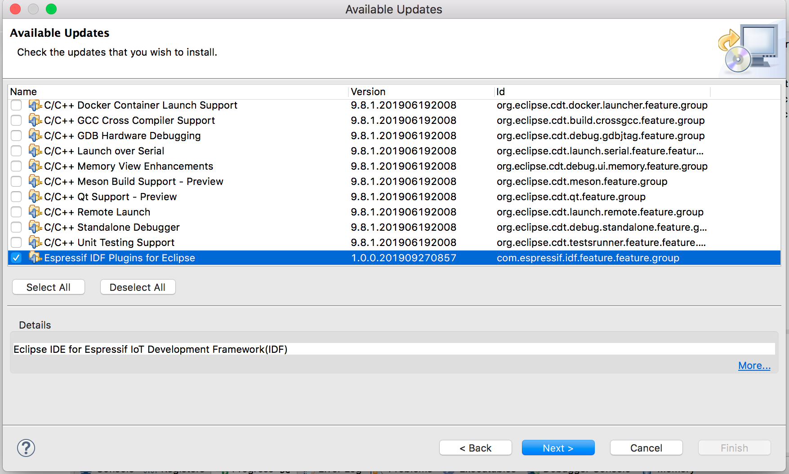
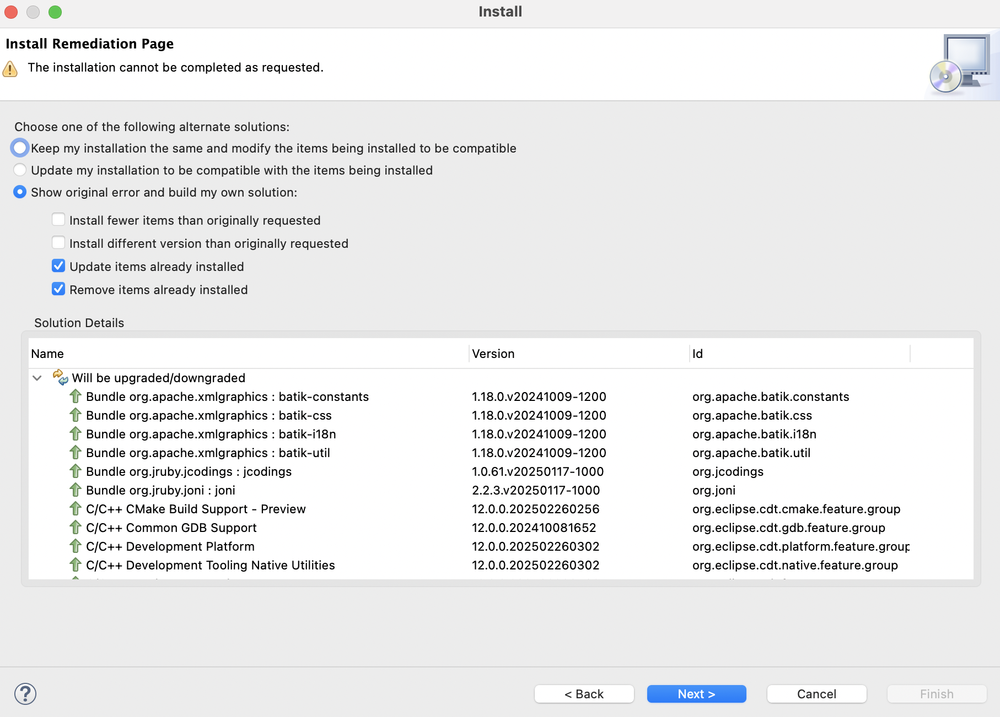

.. _marketplaceupdate:

更新站点安装指南
================

:link_to_translation:`en:[English]`

可通过以下三种方式安装 Espressif-IDE Eclipse 插件：

- :ref:`installUpdateSiteURL`
- :ref:`install_idf_eclipse_plugin_marketplace`
- :ref:`install_idf_eclipse_plugin_local_archive`

.. _installUpdateSiteURL:

使用更新站点 URL 安装 IDF 插件
------------------------------

可以使用更新站点 URL 将 IDF Eclipse 插件安装到现有的 Eclipse CDT 或 Espressif-IDE 中。首先，按如下方式添加发布仓库的 URL：

1.  进入 ``Help`` > ``Install New Software``。
2.  点击 ``Add``，在弹出窗口中：

    * 在 ``Name`` 一栏填写 ``Espressif IDF Plugin for Eclipse``。
    * 在 ``Location`` 一栏，填写插件更新站点的 URL.（`稳定版 <https://dl.espressif.com/dl/idf-eclipse-plugin/updates/latest/>`_）
    * 点击 ``Add``。

3.  全选列表中的组件并继续安装。

若要添加测试版和每日构建版插件，可以使用以下的更新站点 URL：

* `测试版本 <https://dl.espressif.com/dl/idf-eclipse-plugin/updates/beta/>`_
* `每日构建版本 (Nightly Build) <https://dl.espressif.com/dl/idf-eclipse-plugin/updates/nightly/>`_

.. note::

    尽管本文中的截图来自 macOS 系统中的操作，但安装说明同样适用于 Windows 和 Linux。

.. image:: ../../media/idf_update_site_install.png

.. _install_idf_eclipse_plugin_marketplace:

通过 Eclipse 市场安装 IDF Eclipse 插件
--------------------------------------

要通过 Eclipse 市场安装 ESP-IDF Eclipse 插件，请按以下步骤操作：

1. 打开 Eclipse，前往 ``Help`` > ``Eclipse Marketplace...``。
2. 在搜索框中输入 **ESP‑IDF Eclipse Plugin** 找到该插件。
3. 点击 ``Install``，按照屏幕上的提示完成安装。
4. 安装完成后，重启 Eclipse 以启用插件。

.. _install_idf_eclipse_plugin_local_archive:

通过本地压缩包安装 IDF Eclipse 插件
-----------------------------------

要通过本地压缩包安装 ESP-IDF Eclipse 插件，请按以下步骤操作：

1. 点击 `此处 <https://github.com/espressif/idf-eclipse-plugin/releases>`_ 下载 IDF Eclipse 插件的最新更新站点压缩包。
2. 在 Eclipse 中，进入 ``Help`` > ``Install New Software``。
3. 点击 ``Add`` 按钮。
4. 在 ``Add Repository`` 对话框中，选择 ``Archive`` 并选择文件 ``com.espressif.idf.update-vxxxxxxx.zip``。
5. 点击 ``Add``。
6. 在列表中选择 ``Espressif IDF``，然后继续安装。
7. 完成安装后重启 Eclipse。

.. _upgradePlugins:

如何升级现有的 IDF Eclipse 插件
-------------------------------

如果你是首次安装 IDF Eclipse 插件，请按以下步骤添加新版本的仓库：

1. 前往 ``Window`` > ``Preferences`` > ``Install/Update`` > ``Available Software Sites``。
2. 点击 ``Add``。
3. 输入新仓库的 `URL <https://dl.espressif.com/dl/idf-eclipse-plugin/updates/latest/>`_。
4. 点击 ``Ok``。

如果已经通过更新站点 URL 安装了 IDF Eclipse 插件，可按以下步骤升级到最新版本：

1. 进入 ``Help`` > ``Check for Updates``。
2. 如果发现有可用更新版本，选择 ``Espressif IDF Plugins for Eclipse``，并取消选择所有其他项目。
3. 点击 ``Next`` 继续安装。

.. _upgradeEspressifIdeDependencies:

从 Espressif-IDE 3.3.0 升级到 3.4.0
-----------------------------------

如果插件的新版本需要更新依赖项（例如最低 CDT 版本从 11.6 更新到 12），请在通过更新站点安装插件时一并更新这些依赖项。

.. image:: ../../media/Update_dependencies.png

如果所需依赖项未更新，安装程序会显示如下错误：

``The installation cannot be completed as requested.``

解决方法：

1.  点击 ``Show original error and build my own solution``。
2.  然后勾选以下两项：

    - ``Update items already installed``
    - ``Remove items already installed``

这样可以确保安装程序更新或替换任何存在冲突的组件，从而顺利完成安装。

.. _troubleshooting_missing_items:

故障排查
--------

如果在安装过程中遇到错误提示 ``Cannot complete the install because one or more required items could not be found.``，通常是因为未启用 Eclipse 更新站点。

解决方法：

1.  进入 ``Help`` > ``Install New Software``。  
2.  点击 ``Manage``。  
3.  确保已启用 ``Eclipse Platform - Latest Release Update Site`` 选项。

    .. image:: ../../media/Resolve_update_error_2.png

4.  应用更改并关闭对话框。
5.  前往 ``Help`` > ``Check for Updates``，继续更新 IDE 及其依赖项。  

.. note::

    启用 Eclipse Platform 更新站点可确保在安装或升级过程中解析所有必要的依赖项。
