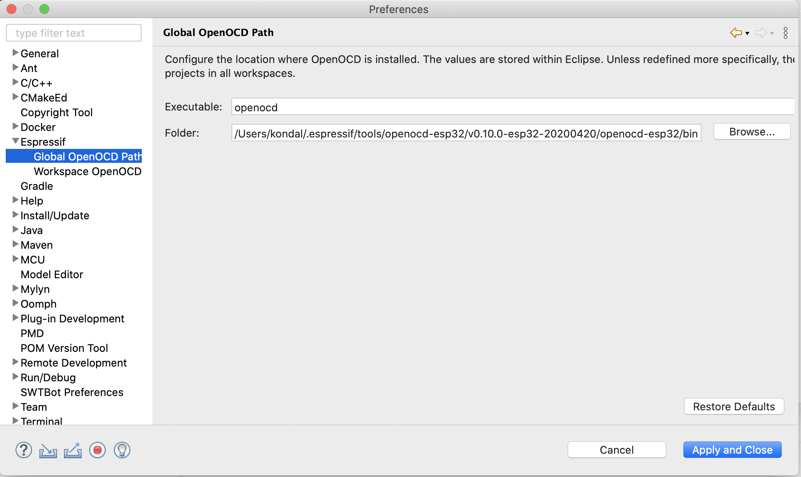

.. _OpenOCDDebugging:

ESP-IDF GDB OpenOCD 调试
========================

:link_to_translation:`en:[English]`

创建新的调试配置
----------------

请按照以下步骤创建新的调试配置：

1. 右键点击项目。
2. 前往 ``Debug As`` > ``Debug Configurations...``，打开调试配置窗口。
3. 在左侧面板中选择 ``ESP-IDF GDB OpenOCD Debugging``。
4. 点击右键并创建 ``New Configuration``，为项目创建新的调试配置。

请逐个查看标签页并配置项目专属设置。 

.. note::

    插件能自动配置大多数设置。

.. image:: ../../media/OpenOCDDebug_4.png

也可以通过启动配置栏来创建调试配置：

1. 展开启动或调试配置的列表。 
2. 点击 ``New Launch Configuration...``。
3. 选择 ``ESP-IDF GDB OpenOCD Debugging`` 并双击此选项，也可以点击 ``Next >`` 按钮。
4. 在 ``Debugger`` 标签页中，检查 ``Config options`` 是否适用于你的开发板。
5. 点击 ``Finish``。

.. image:: ../../media/OpenOCDDebug_9.png

Main 标签页
------------

1. 输入此配置的 ``Name``，默认名称为 "{project_name} Configuration"。
2. 在 ``Main`` 标签页中，找到 ``Project:`` 一栏，点击 ``Browse`` 按钮来选择或更改当前项目。
3. 下一行的 ``C/C++ Application:`` 是指向 elf 文件的相对路径，例如 ``build/hello_world.elf``，对应 ``hello_world`` 项目。若不存在 elf 文件，则此项目可能尚未构建。构建项目后，该 elf 文件会出现，也可以点击 ``Browse`` 按钮进行更改。

``Main`` 标签页中的最后一栏是 ``Build (if required) before launching``。如果不想在每次点击 ``Debug`` 按钮时都构建项目，则选择 ``Disable auto build`` 选项。

上述第 1 至 3 点如下图所示。

.. image:: ../../media/OpenOCDDebug_5.png

Debugger 标签页
---------------

在 ``Debugger`` 标签页中，所有参数都会自动配置以开始调试，你只需检查 ``Config options`` 是否适用于你的开发板即可。该选项会根据 ``Flash voltage`` 和 ``Board`` 选项自动调整。展开开发板列表时，只会显示与所选 ``Target`` 相匹配的条目。举例来说，如果所选目标芯片是 ``esp32``，列表中不会显示 ``ESP32-S2-KALUGA-1``。若希望显示该开发版，需要先将目标芯片改为 ``esp32s2``。``Debugger`` 标签页中的第二个选项是 ``GDB executable``，该选项同样依赖于所选目标芯片，并会根据目标自动进行配置

还有一些其他选项，建议检查这些选项是否已自动正确配置：

4. OpenOCD 的 ``Executable path`` 基于 Eclipse 的首选项，该路径会在安装工具后配置。请检查 ``Actual executable`` 是否正确，如果不正确，很可能是工具安装有问题，因此需要检查工具是否正确安装以避免潜在问题。若在安装工具后 ``Actual executable`` 仍不正确，则点击 ``Browse`` 并手动选择 ``openocd.exe`` 的路径。

5. 接下来，如果要使用内置 GDB 客户端，请确保 GDB 端口为 3333；如果要使用 :doc:`additionalfeatures/appleveltracing`，请确保 TCL 端口为 6666。另请按前文所述检查 ``Config options``。

6. 如上所述，在 ``GDB Client Setup`` 部分中，GDB 可执行文件会根据所选目标自动配置。你也可以点击 ``Browse`` 按钮，手动更改为 GDB 可执行文件的路径。默认情况下，``Commands`` 一行应为 ``set mem inaccessible-by-default off``。

上述第 4 至 6 点如下图所示。

.. image:: ../../media/OpenOCDDebug_6.png

.. note::

    请根据已选择的乐鑫开发板更新 OpenOCD 的 ``Config options``。详情请参考 `此处 <https://docs.espressif.com/projects/esp-idf/zh_CN/latest/esp32/api-guides/jtag-debugging/tips-and-quirks.html#id11>`_。

Startup 标签页
--------------

7. 默认情况下，在加入调试会话前会将二进制文件烧录至开发板，因此无需单独将其烧录到目标芯片上。若出于某些原因不想自动烧录，可以取消勾选 ``Flash every time with application binaries`` 选项。也可以勾选 ``Enable verbose output`` 选项，启用第三调试等级 – ``-d3``。

8.  在 ``Initialization Commands`` 栏目下，``Initial Reset.`` 和 ``Enable ARM semihosting`` 已默认启用，且在输入框中必须填写如下几行内容：

    .. code-block:: text

        mon reset halt
        flushregs
        set remote hardware-watchpoint-limit 2

上述第 7 至 8 点如下图所示。

.. image:: ../../media/OpenOCDDebug_7.png

9. 勾选 ``Load Symbols`` 和 ``Use project binary`` 选项。

10. 在 ``Startup`` 标签页中向下滚动，设置初始断点，以便在调试器复位 CPU 之后暂停 CPU 的运行。插件会在 ``Set break point at:`` 中指定的函数开头设置此断点。勾选该选项，并在输入框中输入主函数名，例如 ``app_main``。

11. 勾选 ``Continue`` 选项。这样，当按照第 8 步调用 ``mon reset halt`` 命令后，程序将自动继续执行，并在 ``app_main`` 函数的断点处停止。

上述第 9 至 11 点如下图所示。

.. image:: ../../media/OpenOCDDebug_8.png

Common 标签页
-------------

可以将调试日志保存为外部文件。操作步骤如下所示：

1. 打开 ``Common`` 标签页。
2. 在 ``Standard Input and Output`` 部分，勾选 ``Output File`` 复选框，然后输入希望重定向日志的文件名和路径。
3. 保存更改并运行应用程序。

.. note::

    - 如果文件位于工作区中，则文件路径可以使用相对路径（见下方截图）。
    - 指定目录路径（以 ``/`` 或 ``\`` 等分隔符结尾）时，系统会自动追加 ``openocd.log`` 为文件名。例如输入 ``/tmp/logs/`` 将会创建 ``/tmp/logs/openocd.log``。

.. image:: ../../media/OpenOCDDebug_13.png

OpenOCD 配置首选项
~~~~~~~~~~~~~~~~~~

OpenOCD 路径会根据 CDT 构建环境变量中定义的 ``OPENOCD_SCRIPTS`` 路径进行自动配置。

开始调试
--------

要开始调试，需要选择调试配置，将模式从 ``Run`` 改为 ``Debug``，并点击启动图标（即小甲虫图标）。

.. image:: ../../media/OpenOCDDebug_10.png

当目标在断点处暂停后，系统会建议切换为 ``Debug perspective``。

.. image:: ../../media/OpenOCDDebug_11.png

你可以根据个人偏好自定义 ``Debug perspective``。例如，你可以移动选项卡、添加你认为有用的其他视图，或移除不需要的视图。可参照以下步骤添加视图：

1. 在 Eclipse 顶部菜单栏中点击 ``Window``。
2. 选择 ``Show View``。
3. 选择要添加的视图。

.. image:: ../../media/OpenOCDDebug_12.png

故障排查
--------

* 请确保你使用的是最新版 `Espressif-IDE <https://github.com/espressif/idf-eclipse-plugin/releases/>`_。
* 如果你的开发板支持或启用了 JTAG，请参考 `此文 <https://docs.espressif.com/projects/esp-idf/zh_CN/latest/esp32/api-guides/jtag-debugging/index.html#jtag-debugging-selecting-jtag-adapter>`_ 了解更多信息。
* 如果出现 OpenOCD 超时问题，请在首选项中增大 GDB 服务器超时设置值 `<https://www.esp32.com/viewtopic.php?f=40&t=36164#p122701>`_。通常在处理较大的应用时会出现超时问题。
* 如果调试时遇到错误，可以参考 OpenOCD `故障排查 FAQ <https://github.com/espressif/openocd-esp32/wiki/Troubleshooting-FAQ>`_，尝试解决问题。
* 如果你遇到问题，并希望启用 OpenOCD 调试的详细日志，请在 ``Startup`` 标签页中勾选 ``Enable verbose output`` 选项。
