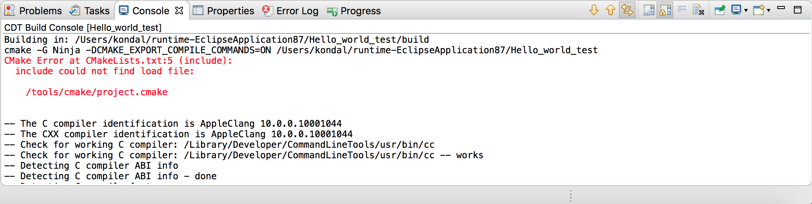

.. _troubleshooting:

故障排查
=========

:link_to_translation:`en:[English]`

- :ref:`suggestions_for_build_errors`
- :ref:`error_log`
- :ref:`console_view_log`
- :ref:`cdt_global_build_log`
- :ref:`espressif_idf_tools_console`

.. _suggestions_for_build_errors:

使用提示查看器解决构建错误
--------------------------

如果在构建过程中遇到问题，ESP-IDF 的提示数据库（位于 ESP-IDF 的 ``tools/idf_py_actions/hints.yml``）中可能存在该错误的提示。ESP-IDF Eclipse 插件提供了提示查看器，你可以在其中输入错误信息以查找对应提示。

**前提条件：** ESP-IDF v5.0 及以上版本提供 ``hints.yml`` 文件。如果你使用的是旧版本的 IDF，可以点击 `此链接 <https://github.com/espressif/esp-idf/blob/master/tools/idf_py_actions/hints.yml>`_ 手动下载 ``hints.yml`` 文件，并保存到 ``esp-idf/tools/idf_py_actions/``。若需下载文件，请右键点击 ``Raw`` 按钮并选择 ``Save as...``。

要打开提示查看器，请依次前往 ``Windows`` > ``Show View`` > ``Other...`` > ``Espressif`` > ``Hints``。

.. image:: https://user-images.githubusercontent.com/24419842/189666994-78cc8b24-b934-426f-9df5-79af28c50c55.png
    :alt: 提示查看器

现在你可以在查看器中输入或粘贴构建日志中的错误，例如：

``ccache error: Failed to create temporary file for esp-idf/libsodium/CMakeFiles/..../....: No such file or directory``

.. image:: https://user-images.githubusercontent.com/24419842/189672552-994624f3-c0c5-48e6-aa2c-61e4ed8915e5.png
    :alt: 提示查看器中的示例错误

如果提示信息未在屏幕上完整显示，可双击此行查看完整提示。

.. image:: https://user-images.githubusercontent.com/24419842/189673174-8ce40cda-6933-4dc4-a555-5d2ca617256e.png
    :alt: 提示信息

.. _error_log:

错误日志
--------

错误日志视图记录插件发出的警告和错误提示。日志文件存储在工作区 ``.metadata`` 子目录下的 ``.log`` 文件中。

要打开错误日志视图，请依次前往 ``Window`` > ``Show View`` > ``Error Log``。

若想导出当前日志内容：

1.  点击工具栏的 ``Export Log`` 按钮，或从右键菜单中选择 ``Export Log...``。

    .. image:: ../../media/export_log.png
        :alt: 导出日志

2. 输入文件名。

建议在报告问题时附上错误日志。

.. _console_view_log:

控制台视图日志
--------------

控制台视图能显示与当前运行进程或构建相关的警告和错误。

要访问控制台视图，前往 ``Window`` > ``Show View`` > ``Console``。

.. _cdt_global_build_log:

CDT 全局构建日志
----------------

要启用全局构建日志，前往 ``Preferences`` > ``C/C++`` > ``Build`` > ``Logging``。

.. _espressif_idf_tools_console:

乐鑫 IDF 工具控制台
-------------------

乐鑫 IDF 工具控制台是控制台视图的一部分，从 Eclipse 安装 IDF 工具时会自动打开。

如果在通过 ``Espressif`` > ``ESP-IDF Tools Manager`` > ``Install tools`` 安装 IDF 工具过程中遇到问题，请检查乐鑫 IDF 工具控制台中的错误信息。

如果该控制台未激活，可在控制台视图中点击 ``Display Selected Console`` 图标切换到该控制台。

.. image:: ../../media/IDF_tools_console.png
   :alt: 乐鑫 IDF 工具控制台
