.. _windowsofflineinstaller:

通过 Windows 离线安装程序安装 Espressif-IDE
======================================================

:link_to_translation:`en:[English]`

`Espressif-IDE with ESP-IDF Windows Offline Installer` 是一个离线安装程序，包含进行 ESP-IDF 应用开发所需的全部组件。

安装程序会部署以下组件：

- 内置 Python
- 交叉编译器
- OpenOCD
- CMake 和 Ninja 构建工具
- ESP-IDF
- Espressif-IDE
- Amazon Corretto OpenJDK

安装程序打包了包括稳定版本的 ESP-IDF在内的所有必要组件和工具，即使处于企业防火墙内，这整套方案也可以开箱即用。安装程序还会在启动 IDE 时自动配置所有必要的构建环境变量和工具路径，因此无需手动进行任何配置，只需直接开始项目开发。这将大大提升你的工作效率！

下载
----

可以点击 `此链接 <https://dl.espressif.com/dl/esp-idf/>`_ 下载最新版安装程序并运行。安装程序的名称可能类似于 ``Espressif-IDE-3.1.1 with ESP-IDF v5.3.1``，具体名称取决于 IDE 和 ESP-IDF 的版本。

按下图所示选择安装程序。

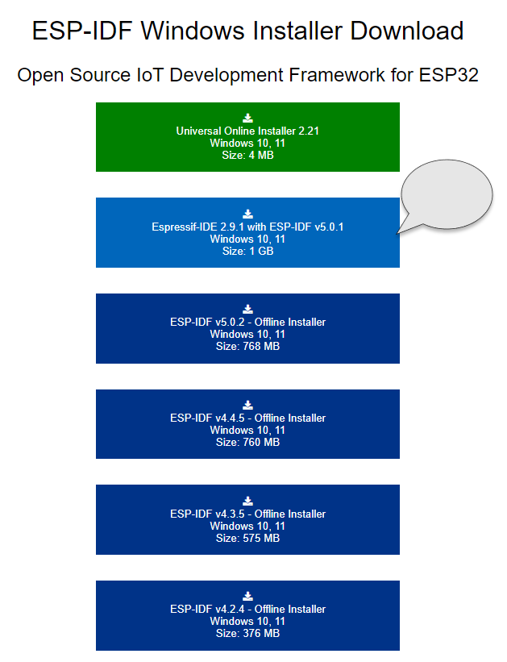

安装
----

安装程序是一个带有 ``.exe`` 扩展名的可执行文件，双击即可运行。

安装程序会引导你完成安装过程，请参阅下面的分步指南。

步骤 1：选择语言
~~~~~~~~~~~~~~~~~~

选择安装程序的语种，然后点击 ``OK``。

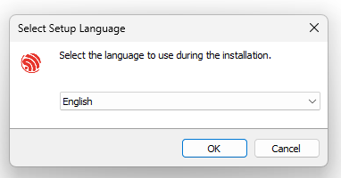

步骤 2：接受产品许可协议
~~~~~~~~~~~~~~~~~~~~~~~~~~

阅读产品许可协议，然后选择 ``I accept the agreement``。必须接受产品许可才能继续安装。点击 ``Next`` 进行下一步操作。

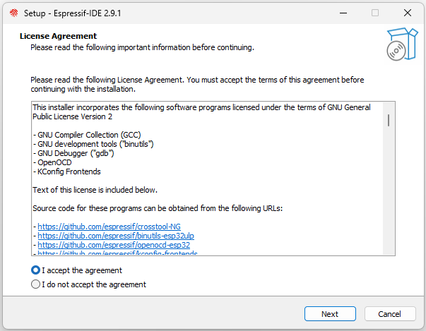

步骤 3：安装前的检查
~~~~~~~~~~~~~~~~~~~~~~

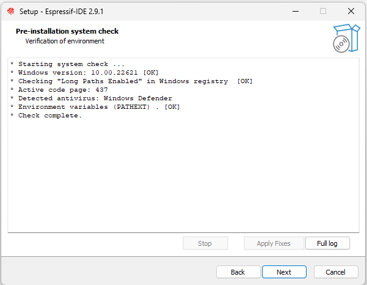

步骤 4：选择安装目录
~~~~~~~~~~~~~~~~~~~~~~

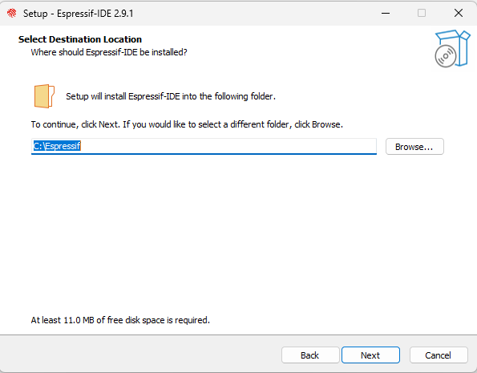

步骤 5：选择要安装的组件
~~~~~~~~~~~~~~~~~~~~~~~~

默认情况下，所有组件都会被选中。如果你不想安装某个组件，可以取消选中它。

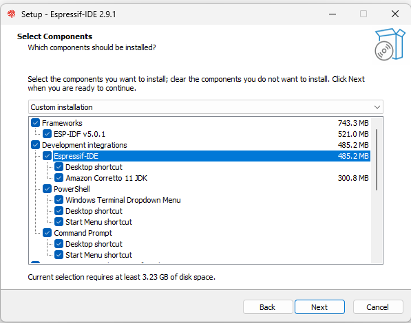

步骤 6：检查安装摘要
~~~~~~~~~~~~~~~~~~~~~

在安装 Espressif-IDE 等组件之前会显示一份摘要以供检查。

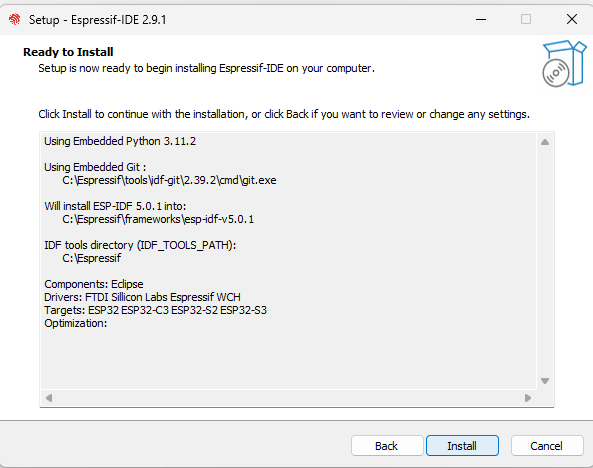
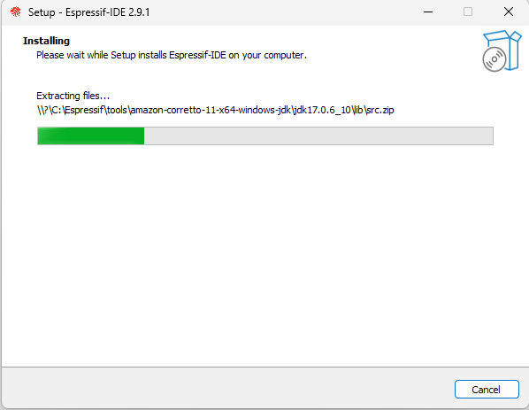

步骤 7：完成安装
~~~~~~~~~~~~~~~~

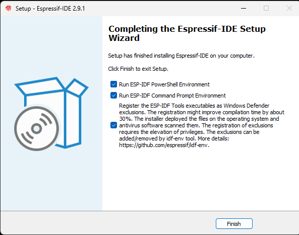
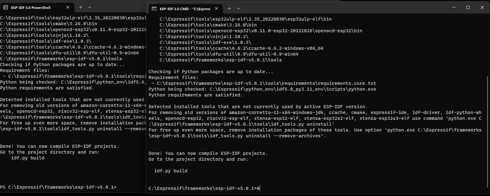

步骤 8：启动 Espressif-IDE
~~~~~~~~~~~~~~~~~~~~~~~~~~

双击图标以启动 Espressif-IDE。

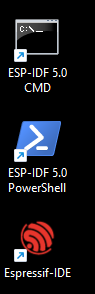

步骤 9：选择 Espressif-IDE 工作区
~~~~~~~~~~~~~~~~~~~~~~~~~~~~~~~~~~~~

建议在 Espressif-IDE 安装程序文件夹之外选择一个工作区目录。

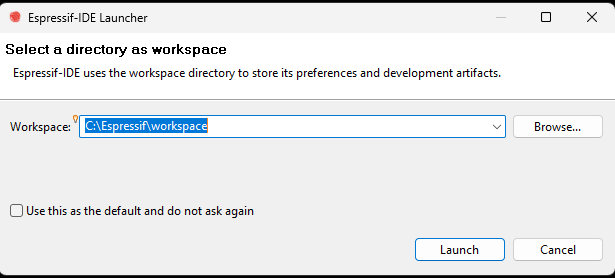

步骤 10：Espressif-IDE 工作台
~~~~~~~~~~~~~~~~~~~~~~~~~~~~~~~~

启动 Espressif-IDE 后，会自动配置所需的环境变量并打开欢迎页面。你可以关闭欢迎页面，无需在 IDE 中运行任何额外的安装工具。

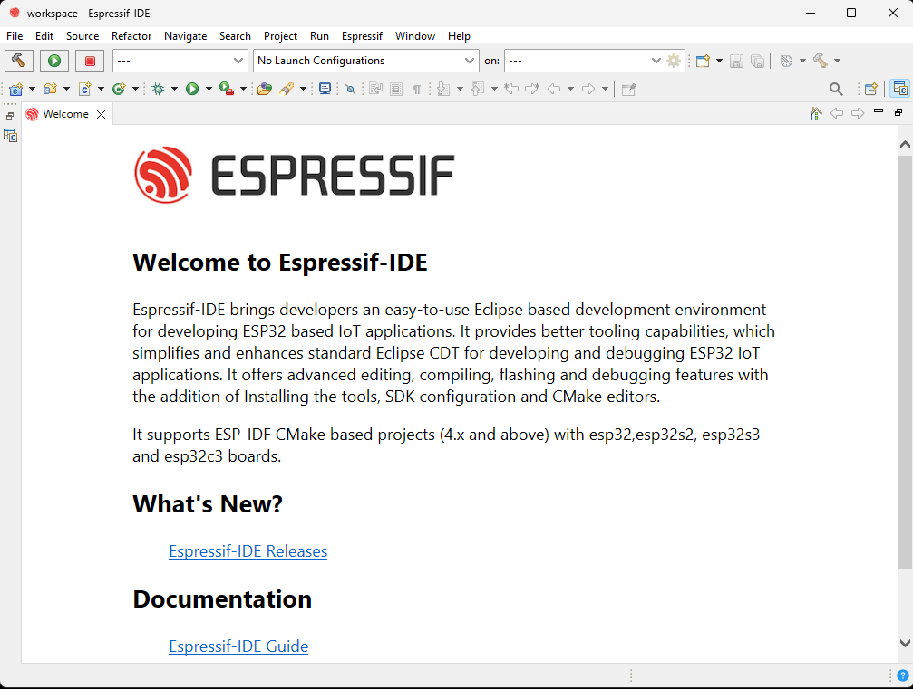

可以在 Eclipse ``Preferences`` 中查看 CDT 构建环境变量。

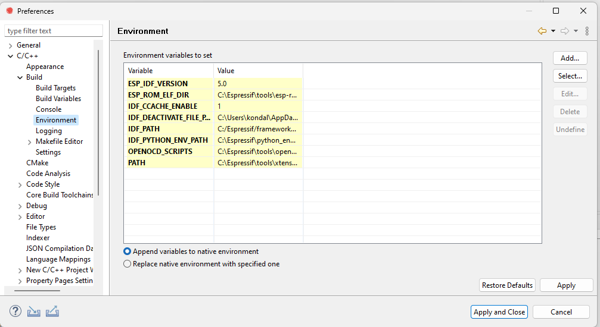

步骤 11：构建首个项目
~~~~~~~~~~~~~~~~~~~~~~

IDE 已经配置好所有必要的环境变量，可以直接开始项目。

有关创建项目的更多详细信息，请参阅文档中的 :ref:`开始项目 <startproject>` 章节。

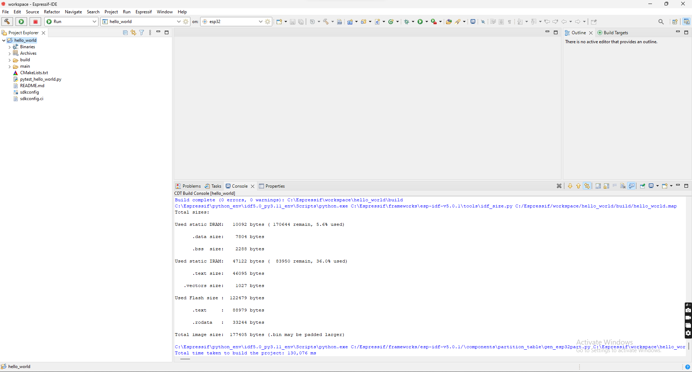
