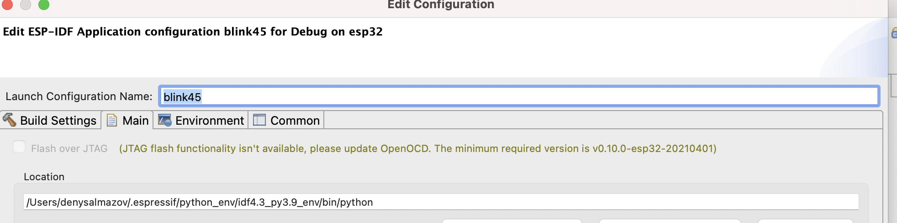

# Upload application via JTAG

The default option for uploading application is UART. To change it to JTAG, you need to edit launch configuration for your project and select the appropriate option.
To do it, select your project in launch configuration bar and click on wheel to edit launch configuration:

Then select the `Flash Over JTAG` option and fill the `OpenOCD Setup` section.

If the `Flash Over JTAG` option is not available and you see message like this: 

It means that OpenOCD needs to be updated. You can find the latest OpenOCD version on the <a href="https://github.com/espressif/openocd-esp32/releases"> openocd-esp32 GitHub page</a>.

## Providing the right path for OpenOCD

After downloading the necessary <a href="https://github.com/espressif/openocd-esp32/releases"> OpenOCD version</a> you need to extract it to the new folder in the `.espressif/tools/openocd-esp32/`. So make sure you are following these steps:

* Download required <a href="https://github.com/espressif/openocd-esp32/releases/tag/v0.10.0-esp32-20201202"> v0.10.0-esp32-20201202</a>. version or higher for the JTAG Flashing
* Go to `.../.espressif/tools/openocd-esp32/`, create a new folder named `v0.10.0-esp32-20201202` there and extract openOCD there.
* The resulting path to the openocd might have a look like: `.../.espressif/tools/openocd-esp32/v0.10.0-esp32-20201202/openocd-esp32/...`

After doing this, update the `OPENOCD_SCRIPT` environment variable in the eclipse.

* Go to `Eclipse > Preferences > C/C++ > Build > Environment`
* Edit `OPENOCD_SCRIPTS` variable by providing the right path to the `openocd/scripts` folder
* As a result, the path to the OpenOCD scipts may look like this: `.../.espressif/tools/openocd-esp32/v0.10.0-esp32-20201202/openocd-esp32/share/openocd/scripts`
