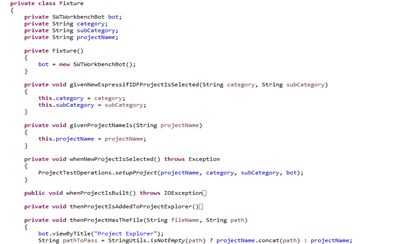

# SWTBot Automation Framework Guide (Developers)

SWTBot is a testing framework for eclipse RCP and it offers apis to expose the functionality of eclipse features. Further readings about this can be done from these links to get a quick start guide on what it is.
https://www.vogella.com/tutorials/SWTBot/article.html 
https://www.eclipse.org/swtbot/ 

I have created an initial structure or framework to help you write functional tests. The idea is to use the existing structure and add or update the tests according to the requirements following the existing package conventions this doesn't mean that new packages cannot be created but rather must not be duplicated with different names. 

I will try to explain the project structure by explaining the tests added for creating a new project.

## Test project structure

The tests can be found in the `com.espressif.idf.test` folder. The structure of the tests project is as shown below.

### Resources Directory

The resources directory was added to contain the files that can be used as resources when testing, like in the default-files we have a complete directory structure for the test to contain files in the same relative path as a project created currently it has only two files /main/CMakeLists.txt and .project

These files were added so they can be compared with the file being created by a new project. The purpose of doing this was so that in future when we make some changes to our plugin that affects these files we can simply update these files as well instead of trying to go back into the java class and rewrite the test, although that can be needed if the changes are of a different nature then simple file change.

### Configs Directory

The configs directory contains the default-configs required for the tests they contain some configuration like build delay and some other UI awaiting delays can be added here as well, the idea is to keep only the default baseline configs here and if a functionality is taking some extensive UI operations that are not part of default operations, we can introduce another property file to contain those configurations. Currently this contains a setting for the build delay required and some absolute paths that are not relative to the repository or a central location we will try to update this once the CI for the automation is complete and the updated version of this document will contain isntructions on them. For now if your test needs to contain a property use this file and use the `**DefaultPropertyFetcher.java**` for fetching that property, for paths you can use the path on your own local env for the moment, also make sure to update these paths when you are trying to run the test.

### Test Classes
Test cases themselves are to be placed in the `**com.espressif.idf.tests.exectuables.cases**` package. They can be further subdivided into their own packages in this package based upon the functionality they are testing for example at the time of writing this following packages are present that contain different test executable classes.

## Overview of GWT (Given When Then)

Now to discuss the GWT approach the purpose is that this approach makes it easier to understand the tests so that when you are reading a test code you can quickly tell that what will this case be testing and if it is failing you will be able to quickly navigate or at least shortlist the area that is causing the failure. To explain this further let me share the test class I have added below.

Now by reading the test case expanded above you can easily see the functionality it is testing. The methods being referenced from the fixture could have been a part of this class but that would not have been very clean way, so we create a new child class in our test class and call it fixture that hides all the implementation of the test operations in the given when then methods.

The below is a partial screenshot for fixture class in the above stated test class to give you an idea of the implementation.

## Creating an SWTBot Test Class

To create a test class you just need to annotate it with `@Runwith(SWTBotJunit4ClassRunner.class)` this will allow you to save yourself from debugging launch configuration issues and it also provides a facility where it takes the screenshot if a test fails and save it in the screenshots folder with the name of the test.
Test methods are to be annotated with `@Test` in `org.junit.Test` which is JUnit4 library and must be public.
All your given when and then methods will go inside your fixture class as shown in previous section. Hence the test method will only have the calls to those methods in the inner Fixture class. All the working will be done within the fixture class methods even the SWTBot is defined inside the Fixture class that interacts with the UI during test.
After you have created your test class and you have some test methods in it you have to launch the test to verify on your local environment you can do that with eclipse. There are two ways to do that and I will try to explain both of them here.

### Using SWTBot Test Runner Launch Config
This is the most recommended method as this eliminates some issues specially related to ambiguous exceptions for `WidgetNotFound`. You can generate a launch config simply by right clicking on your test class and from context menu select `Run As` in the sub menu select the option `SWTBot Test`.

This will start execution of your test but there are a few things that you need to verify before doing that so stop the ongoing task by pressing stop button in console.

Now from launch configurations in the Eclipse CDT Launchbar click on edit button next to the launch configuration name.

From the opened screen you can see some settings. First thing to make sure is that you use **JUnit4** from the `Test runner:` drop down. 
Some other settings you can see here are that you have the option to select a single method as well to do that simply click on `Search...` in front of `Test method:` text box and select the method you want to test you can select `(all methods)` from the window to run the complete class as test. **An Important note to add here is that each test method you add must not be dependent on any other method means it should cover its own case and the must take care of cleaning the environment before it exits so that other tests are not affected by it**

Also important is that if you have installed the Espressif eclipse plugin already you don't want those installed plugins to be part of the eclipse launched in the test but rather it should be launched with the espressif plugins from the workspace. Headover to the `Plug-ins` tab.

From the drop down `Launch with:` select the option `plug-in selected below only`. Now make sure that all the espressif plugins are **unchecked** that are in the `Target Platform` and select all the plugins from the `Workspace`. Also make sure that test project is selected from Workspace without it the eclipse will not be able to run test as all the dependencies for SWTBot are in that project.

Make sure to click on `Validate Plug-ins` button to see if there are any issues with them, if you get any errors try to use the `Add Required Plug-ins` button which will automatically resolve the issues and if you still see the problems try to add those plugins manually by using the filter text box by entering name of the plugin

If there is no issue with your eclipse or SWTBot installation you should be able to run your test using the configuration.

### Using JUnit Runner Launch Config
At times we need to debug the tests and for some issues in the SWTBot API you will get the exception of `WidgetNotFound` during debug which is because the SWTBot is dependent on UI focus a lot and during a test run if you are using the machine and the test instance of eclipse looses focus it gives that exception during debug we have to make sure that breakpoints are properly placed so that during UI interaction the test instance stays in focus. The SWTBot Runner config in eclipse for me prior to eclipse 2021-06 alway gave issues during debug so I had to use the JUnit Runner Launch Config.

You can generate this launch config simply by right clicking on your test class and from context menu select `Run As` in the sub menu select the option `JUnit Plug-in Test`.

This will start execution of your test but just like SWTBot there are a few things that you need to verify before doing that so stop the ongoing task by pressing stop button in console.

Now from launch configurations in the Eclipse CDT Launchbar click on edit button next to the launch configuration name which is just added.

From the opened screen you can see some settings. First thing to make sure is that you use **JUnit4** from the `Test runner:` drop down. Alos make sure that `Run in UI thread` is unchecked.
Now headover to the `Plug-ins` tab and follow the same configuration steps as you did for SWTBot Launc Config